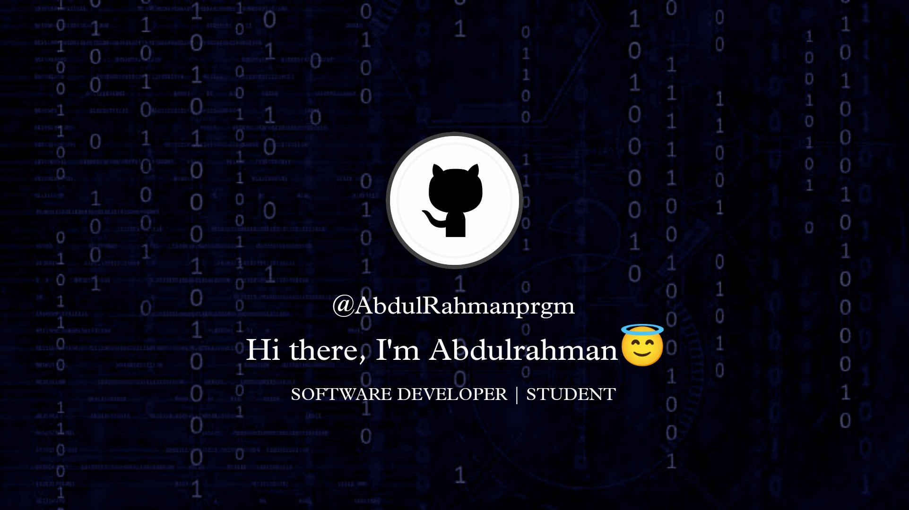

# ABOUT ME
   
    ~  🔭 I’m currently working on Web development
  
    ~  🌱 I’m currently learning JavaScript

    ~  😜 Favourite color: blue
    
    ~  🧑‍💻 Little bit knowledge about ethical hacking

# Contact
 

## 🧑‍💻 ⬇️ 🧑‍💻 :
# Prgramming language
 
 

# Frontend development 
 

# Frameworks
 
 
 
# DATABASE

# DESIGN

